# ES6

1.  let和const命令 作用域
    1.  1概要与总结
        1.  声明
            1.  const命令：声明常量
            2.  let命令：声明变量
        2.  作用
            1.  1作用域
                1.  全局作用域
                2.  函数作用域
                3.  块级作用域
            2.  2作用范围
                1.  var命令在全局代码中执行
                2.  const命令和let命令只能在代码中执行
            3.  3 赋值使用
                1.  const命令声明常量后必须立马赋值
                2.  let命令声明变量后可立马赋值或使用时赋值
            4.  声明方法：var const let function class import
                1.  不允许重复声明
                2.  未定义就使用会报错：const命令和let命令不存在变量提升
                3.  暂时性死区：在代码块内使用const命令和let命令声明变量之前, 该变量都不可用
    2.  2 let关键命令
        1.  不允许重复声明
        2.  块级作用域
        3.  不存在变量提升
        4.  不影响作用域链
    3.  3 const关键字命令
        1.  不允许重复声明
        2.  值不允许修改
        3.  不存在变量提升
        4.  块级作用域
        5.  声明必须赋初始值
        6.  标识符一般为大写
        7.  注意 ：对象属性修改和数组元素变化不会触发const错误
        8.  应用场景：声明对象类型，确定不会再次赋值的变量使用const，其他的可以使用let
    4.  4 es6 声明变量的六种方法
        1.  ES6 除了添加let和const命令, 后面还会提到, 另外两种声明变量的方法：import命令和class命令。所以 , ES6 一共有 6 种声明变量的方法。
    5.  5 块级作用域
        1.  1 为什么要用块级作用域
            1.  第一种场景：内层变量可能会覆盖外层变量
            2.  第二种场景：用来计数的循环变量泄露为全局变量
        2.  2 Es6的块级作用域
            1.  允许块级作用域的任意嵌套
            2.  内层作用域可以定义外层作用域的同名变量
2.  赋值解构
    1.  定义
        1.  从数组和对象中提取值，对变量进行赋值 本质上属于模式匹配
    2.  1概括总结
        1.  1字符串解构 const [a, b, c, d, e] = "hello"
        2.  2**数值解构**：const { toString: s } = 123
        3.  3**布尔解构**：const { toString: b } = true
        4.  **4对象解构**
            1.  形式：const { x, y } = { x: 1, y: 2 }
            2.  默认：const { x, y = 2 } = { x: 1 }
            3.  改名：const { x, y: z } = { x: 1, y: 2 }
        5.  **5数组解构**
            1.  规则：数据结构具有Iterator接口可采用数组形式的解构赋值
            2.  形式：const [x, y] = [1, 2]
            3.  默认：const [x, y = 2] = [1]
        6.  **6函数参数解构**
            1.  数组解构：function Func([x = 0, y = 1]) {}
            2.  对象解构：function Func({ x = 0, y = 1 } = {}) {}
        7.  应用场景
            1.  交换变量值：[x, y] = [y, x]
            2.  返回函数多个值：const [x, y, z] = Func()
            3.  定义函数参数：Func([1, 2])
            4.  提取JSON数据：const { name, version } = packageJson
            5.  定义函数参数默认值：function Func({ x = 1, y = 2 } = {}) {}
            6.  遍历Map结构：for (let [k, v] of Map) {}
            7.  输入模块指定属性和方法：const { readFile, writeFile } = require("fs")
        8.  \*\* 重点难点 \*\*
            1.  匹配模式：只要等号两边的模式相同, 左边的变量就会被赋予对应的值
            2.  解构赋值规则：只要等号右边的值不是对象或数组, 就先将其转为对象
            3.  解构默认值生效条件：属性值严格等于undefined
            4.  解构遵循匹配模式
            5.  解构不成功时变量的值等于undefined
            6.  undefined和null无法转为对象, 因此无法进行解构
    3.  2基本用法
        1.  1 基本用法举例
            1.  let [foo, [[bar], baz]] = [1, [[2], 3]];//foo : 1 bar : 2 baz : 3
            2.  let [ , , third] = ["foo", "bar", "baz"];//third : "baz"
            3.  let [x, , y] = [1, 2, 3];//x : 1 y : 3
            4.  let [head, ...tail] = [1, 2, 3, 4];//head : 1 tail : [2, 3, 4]
            5.  let [x, y, ...z] = ['a'];//x : "a" y : undefined z : []
        2.  2 默认值
            1.  let [foo = true] = [];//foo = true
            2.  let [x, y = 'b'] = ['a']; // x='a', y='b'
            3.  let [x, y = 'b'] = ['a', undefined]; // x='a', y='b'
            4.  注意 , ES6 内部使用严格相等运算符（===）, 判断一个位置是否有值。所以, 只有当一个数组成员严格等于undefined, 默认值才会生效。
        3.  小用法
            1.  let obj = {a:{b:1}}
            2.  const {a} = obj; //传统解构赋值
            3.  const {a:{b}} = obj; //连续解构赋值
            4.  const {a:{b:value}} = obj; //连续解构赋值+重命名
    4.  3 对象的赋值解构
        1.  1 基本用法
            1.  let { foo, bar } = { foo: 'aaa', bar: 'bbb' };//foo = "aaa"; bar = "bbb"
            2.  对象的解构与数组有一个重要的不同。数组的元素是按次序排列的, 变量的取值由它的位置决定；而对象的属性没有次序, 变量必须与属性同名, 才能取到正确的值
            3.  如果变量名与属性名不一致, 必须写成下面这样--\>取别名
                1.  let { foo: baz } = { foo: 'aaa', bar: 'bbb' };//baz = "aaa"let obj = { first: 'hello', last: 'world' };let { first: f, last: l } = obj;//f = 'hello' ; l = 'world'
    5.  4 字符串的赋值解构
        1.  字符串也可以赋值解构。这是因为此时字符串被转换成了一个类似数组的对象
        2.  例如
            1.  const [a, b, c, d, e] = 'hello';//a == "h" ;b == "e" ; c == "l" ; d == "l" ;e == "o"
            2.  类似数组的对象都有一个length属性, 因此还可以对这个属性解构赋值。
                1.  let {length : len} = 'hello';//len == 5
    6.  5 数值和布尔值的解构赋值
        1.  解构赋值时, 如果等号右边是数值和布尔值, 则会先转为对象
    7.  6 函数参数的解构赋值
        1.  

            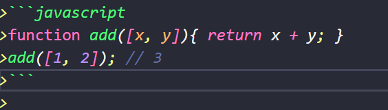

            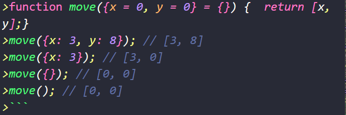

    8.  7 数组的赋值解构
        1.  *可以实现\`一行代码实现两个变量的互换[x,y]=[y,x]\`*
        2.  

            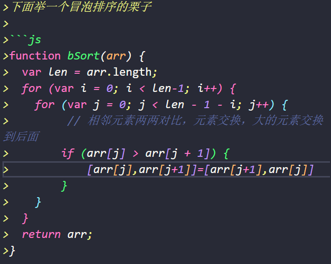

    9.  8 圆括号问题
        1.  *\>解构赋值虽然很方便, 但是解析起来并不容易. 对于编译器来说, \`一个式子到底是模式, 还是表达式\`, 没有办法从一开始就知道, 必须解析到（或解析不到）等号才能知道.*
        2.  不能使用圆括号的情况
            1.  let *[(a)] = [1];*
            2.  *\>*let *{x: (c)} = {};*
            3.  *\>*let *({x: c}) = {};*
            4.  *\>*let *{(x: c)} = {};*
            5.  *\>*let *{(x): c} = {};*
            6.  *\>*let *{ o: ({ p: p }) } = { o: { p: 2 } };*
            7.  *\>*function *f([(z)]) { return z; }*
            8.  *\>*function *f([z,(x)]) { return x; }*
            9.  *\>({ p: a }) = { p: 42 }; ([a]) = [5];*
        3.  可以使用圆括号的情况
            1.  *\>[(b)] = [3]; // 正确*
            2.  *\>({ p: (d) } = {}); // 正确*
            3.  *\>[(parseInt.prop)] = [3]; // 正确*
    10. 9 具体应用场景举例
        1.  1交换变量的值
            1.  *[x, y] = [y, x]*
        2.  2 从函数返回多个值
            1.  

                

        3.  3 函数参数的定义
            1.  

                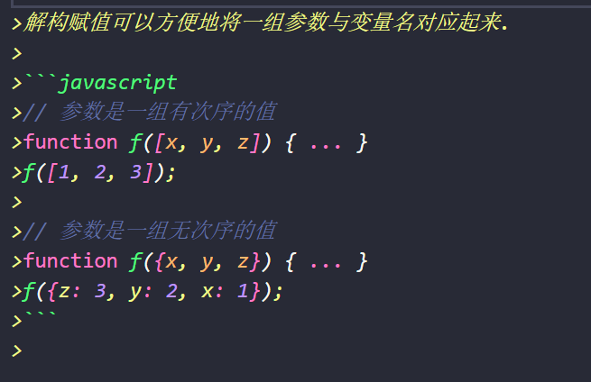

        4.  4 提取json数据
            1.  

                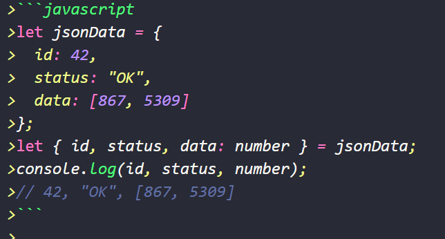

        5.  5 函数参数的默认值
            1.  

                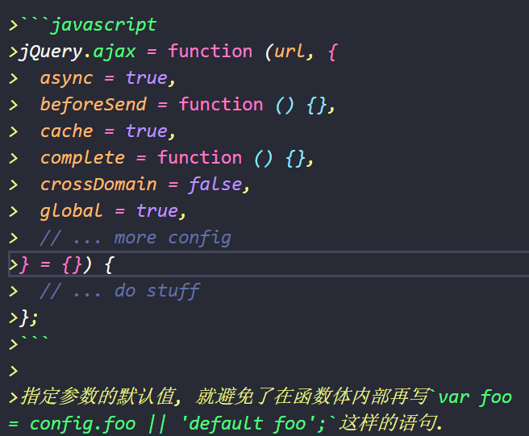

        6.  6 遍历map结构
            1.  *任何部署了 Iterator 接口的对象, 都可以用\`for...of\`循环遍历. Map 结构原生支持 Iterator 接口, 配合变量的解构赋值, 获取键名和键值就非常方便.*
            2.  

                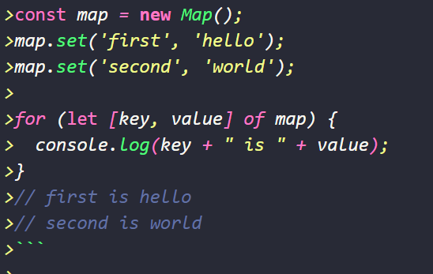

        7.  7 输入模块的指定方法
            1.  const *{ SourceMapConsumer, SourceNode } = require("source-map");*
3.  字符串的扩展。
    1.  概括总结
        1.  **\*\*Unicode表示法\*\****: \`大括号包含\`表示Unicode字符(\`\\u{0xXX}\`或\`\\u{0XXX}\`)*
        2.  **\*\*字符串遍历\*\****: 可通过 [ for-of ] 遍历字符串*
        3.  **\*\*字符串模板\*\****: 可单行可多行可插入变量的增强版字符串*
        4.  **\*\*标签模板\*\****: 函数参数的特殊调用*
        5.  **\*\*String.raw()\*\****: 返回把字符串所有变量替换且对斜杠进行转义的结果*
        6.  **\*\*String.fromCodePoint()\*\****: 返回码点对应字符*
        7.  **\*\*codePointAt()\*\****: 返回字符对应码点(\`String.fromCodePoint()\`的逆操作)*
        8.  **\*\*normalize()\*\****: 把字符的不同表示方法统一为同样形式, 返回\`新字符串\`(Unicode正规化)*
    2.  模板字符串
        1.  *模板字符串（template string）是增强版的字符串, 用反引号[ \` ]标识. 它可以当作普通字符串使用, 也可以用来定义多行字符串, 或者在字符串中嵌入变量. 嵌入变量使用[\`\${变量名}\`]*
        2.  1 字符串中可以出现换行符
            1.  *\<ul\>\`标签前面会有一个换行. 如果你不想要这个换行, 可以使用\`trim\`方法消除它.*

                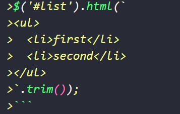

        3.  2 可以使用\${xxx}形式输出变量
            1.  *\`User* *\${*[user.name](http://user.name/)*}* *is not authorized to do* *\${action}.\`);*
        4.  3 大括号内部可以放任意的javascript表达式
            1.  *\>*let *x = 1;*
            2.  *\>*let *y = 2;*
            3.  *\>\`\${x} + \${y} = \${x + y}\`// "1 + 2 = 3"*
            4.  *\>\`\${x} + \${y \* 2} = \${x + y \* 2}\`// "1 + 4 = 5"*
            5.  *\>*let *obj = {x: 1, y: 2};*
            6.  *\>\`\${obj.x + obj.y}\`// "3"*
        5.  4 模板字符串之中还能调用函数
            1.  function *fn() { return "Hello World";}*
            2.  *\>\`foo \${fn()} bar\`*
        6.  字符串嵌套
            1.  

                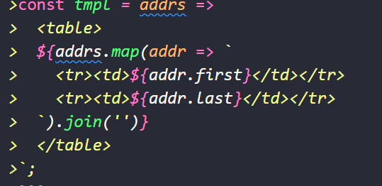

        7.  
    3.  标签模板
        1.  阅读性较差，只是了解了一下
        2.  他的一个重要的作用就是：过滤html 字符串，防止用户输入恶意内容
4.  数值的扩展
    1.  **1概括总结**
        1.  **二进制表示法: \`0b或0B开头\`表示二进制(\`0bXX\`或\`0BXX\`)**
        2.  **八进制表示法: \`0o或0O开头\`表示二进制(\`0oXX\`或\`0OXX\`)**
        3.  **指数运算符:其实这是\`ES2016\` 新增的 ,指数运算符（\`\*\*\`）**
        4.  **\*\*Number.EPSILON\*\****: 数值最小精度*
        5.  *\>* **\*\*Number.MIN_SAFE_INTEGER\*\****: 最小安全数值(\`-2\^53\`)*
        6.  *\>* **\*\*Number.MAX_SAFE_INTEGER\*\****: 最大安全数值(\`2\^53\`)*
        7.  *\>* **\*\*Number.parseInt()\*\****: 返回转换值的整数部分*
        8.  *\>* **\*\*Number.parseFloat()\*\****: 返回转换值的浮点数部分*
        9.  *\>* **\*\*Number.isFinite()\*\****: 是否为有限数值*
        10. *\>* **\*\*Number.isNaN()\*\****: 是否为NaN*
        11. *\>* **\*\*Number.isInteger()\*\****: 是否为整数*
        12. *\>* **\*\*Number.isSafeInteger()\*\****: 是否在数值安全范围内*
        13. *\>* **\*\*Math.trunc()\*\****: 返回数值整数部分*
        14. *\>* **\*\*Math.sign()\*\****: 返回数值类型(\`正数1\`、\`负数-1\`、\`零0\`)*
        15. *\>* **\*\*Math.cbrt()\*\****: 返回数值立方根*
        16. *\>* **\*\*Math.clz32()\*\****: 返回数值的32位无符号整数形式*
        17. *\>* **\*\*Math.imul()\*\****: 返回两个数值相乘*
        18. *\>* **\*\*Math.fround()\*\****: 返回数值的32位单精度浮点数形式*
        19. *\>* **\*\*Math.hypot()\*\****: 返回所有数值平方和的平方根*
        20. *\>* **\*\*Math.expm1()\*\****: 返回\`e\^n - 1\`*
        21. *\>* **\*\*Math.log1p()\*\****: 返回\`1 + n\`的自然对数(\`Math.log(1 + n)\`)*
        22. *\>* **\*\*Math.log10()\*\****: 返回以10为底的n的对数*
        23. *\>* **\*\*Math.log2()\*\****: 返回以2为底的n的对数*
        24. *\>* **\*\*Math.sinh()\*\****: 返回n的双曲正弦*
        25. *\>* **\*\*Math.cosh()\*\****: 返回n的双曲余弦*
        26. *\>* **\*\*Math.tanh()\*\****: 返回n的双曲正切*
        27. *\>* **\*\*Math.asinh()\*\****: 返回n的反双曲正弦*
        28. *\>* **\*\*Math.acosh()\*\****: 返回n的反双曲余弦*
        29. *\>* **\*\*Math.atanh()\*\****: 返回n的反双曲正切*
    2.  2指数运算（\*\*）
        1.  多个指数运算时，从最右边开始计算
5.  函数的扩展
    1.  1 概括总结
        1.  *形式: \`function Func(x = 1, y = 2) {}\`*
        2.  2 箭头函数（=\>）
            1.  类型
                1.  *无参数: \`() =\> {}\`*
                2.  *单个参数: \`x =\> {}\`*
                3.  *多个参数: \`(x, y) =\> {}\`*
                4.  *解构参数: \`({x, y}) =\> {}\`*
        3.  3 rest/spread参数(...)
            1.  *形式: 以数组的形式存在, 之后不能再有其他参数*
            2.  *代替\`Arguments对象\`*
            3.  *length: 返回没有指定默认值的参数个数但不包括\`rest/spread参数\`*
        4.  4 严格模式
            1.  *应用: 只要函数参数使用默认值、解构赋值、扩展运算符, 那么函数内部就不能显式设定为严格模式*
        5.  5 name属性
        6.  6 箭头函数常见误区的正解
            1.  *1. 函数体内的 [ this ] 是\`定义时所在的对象\`而不是\`使用时所在的对象\`*
            2.  *2. 可让 [ this ] 指向固定化, 这种特性很有利于封装回调函数*
            3.  *3. 不可当作\`构造函数\`, 因此箭头函数不可使用\`new命令\`*
            4.  *4. 不可使用\`yield命令\`, 因此箭头函数不能用作\`Generator函数\`*
            5.  *5. 不可使用\`Arguments对象\`, 此对象在函数体内不存在(可用\`rest/spread参数\`代替)*
            6.  *6. 返回对象时必须在对象外面加上括号*
    2.  2 函数参数的默认值
        1.  1 基本用法
            1.  可以在函数声明时给参数赋值
            2.  参数默认值的位置
                1.  *通常情况下, 定义了默认值的参数, 应该是函数的尾参数. 因为这样比较容易看出来, 到底省略了哪些参数. 如果非尾部的参数设置默认值, 实际上这个参数是没法省略的.*
            3.  函数的length属性
                1.  *指定了默认值以后, 函数的\`length\`属性, 将返回没有指定默认值的参数个数. 也就是说, \`指定了默认值后 , length属性将失真\`.*
            4.  作用域
                1.  *一旦设置了参数的默认值, 函数进行声明初始化时, 参数会形成一个单独的作用域（context）. 等到初始化结束, 这个作用域就会消失*
            5.  应用
                1.  *利用参数默认值, 可以指定某一个参数不得省略, 如果省略就抛出一个错误*
                    1.  

                        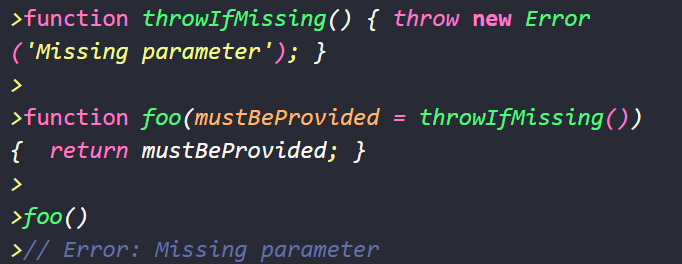

        2.  2 箭头函数
            1.  基本用法
                1.  var *f = v* =\> *v 等同于 var f = function (v) return v*
                2.  一般情况下在返回时要加入一个括号，防止把大括号当成了代码块
                3.  它可以与解构赋值一起使用
                    1.  

                        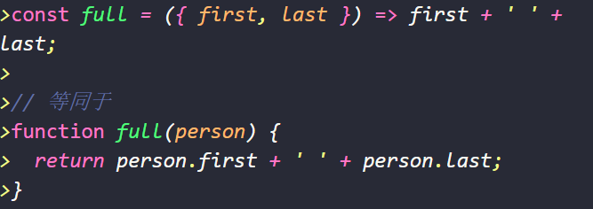

                4.  与rest参数结合使用
                    1.  

                        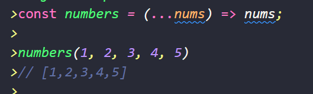

            2.  注意事项
                1.  *1）函数体内的 [ this ] 对象, 就是定义时所在的对象, 而不是使用时所在的对象.*
                2.  *（2）不可以当作构造函数, 也就是说, 不可以使用\`new\`命令, 否则会抛出一个错误*
                3.  *（3）不可以使用\`arguments\`对象, 该对象在函数体内不存在. 如果要用, \`可以用 rest 参数代替\`*
                4.  *4）不可以使用\`yield\`命令, 因此箭头函数\`不能用作 Generator 函数\`.*
            3.  不适用场合
                1.  *第一个场合是定义对象的方法, 且该方法内部包括 [ this ] .*
                2.  *第二个场合是需要动态 [ this ] 的时候, 也不应使用箭头函数.*
            4.  嵌套的箭头函数
                1.  

                    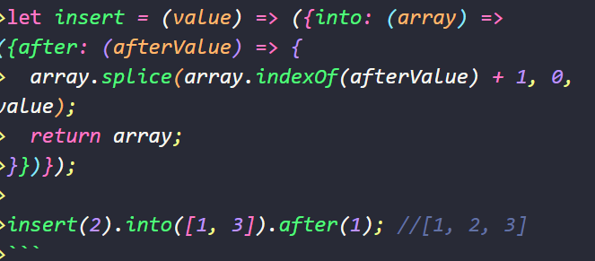

        3.  3 rest函数
            1.  *形式为\`...变量名\`用于获取函数的多余参数*
            2.  

                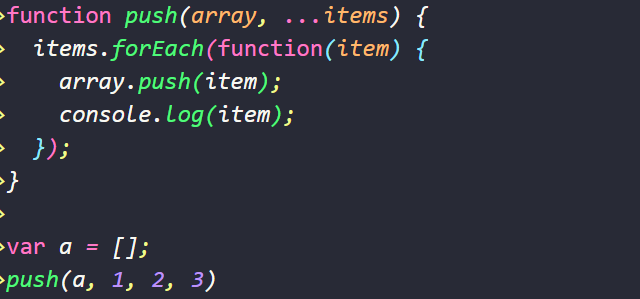

            3.  *注意 , rest 参数之后不能再有其他参数（即只能是最后一个参数）, 否则会报错.*
        4.  4 严格模式
            1.  *规定只要函数参数使用了默认值、解构赋值、或者扩展运算符, 那么函数内部就不能显式设定为严格模式, 否则会报错\`.*
            2.  *两种方法可以规避这种限制*
                1.  *第一种是设定全局性的严格模式, 这是合法的*
                2.  *第二种是把函数包在一个无参数的立即执行函数里面..*
        5.  5 name属性
            1.  *函数的\`name\`属性, 返回该函数的函数名.*
        6.  6 尾调用优化（有点没看懂）
            1.  *尾调用（Tail Call）是函数式编程的一个重要概念, 本身非常简单, 一句话就能说清楚, 就是指某个函数的最后一步是调用另一个函数.*
            2.  *这三个不属于尾调用.*
                1.  

                    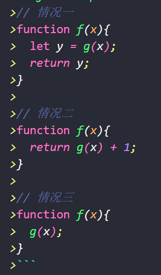
