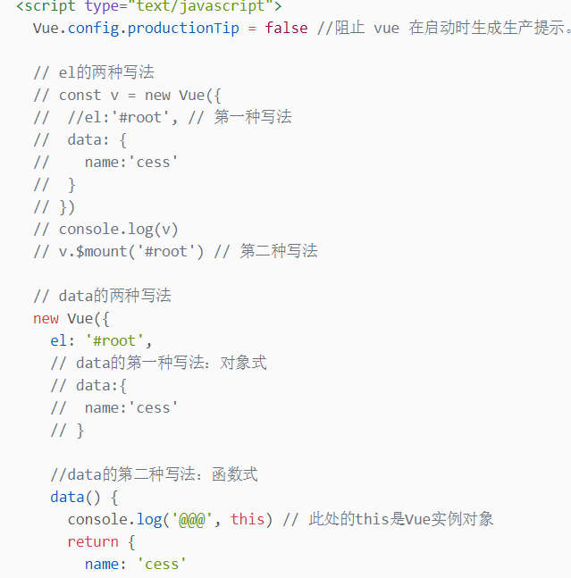
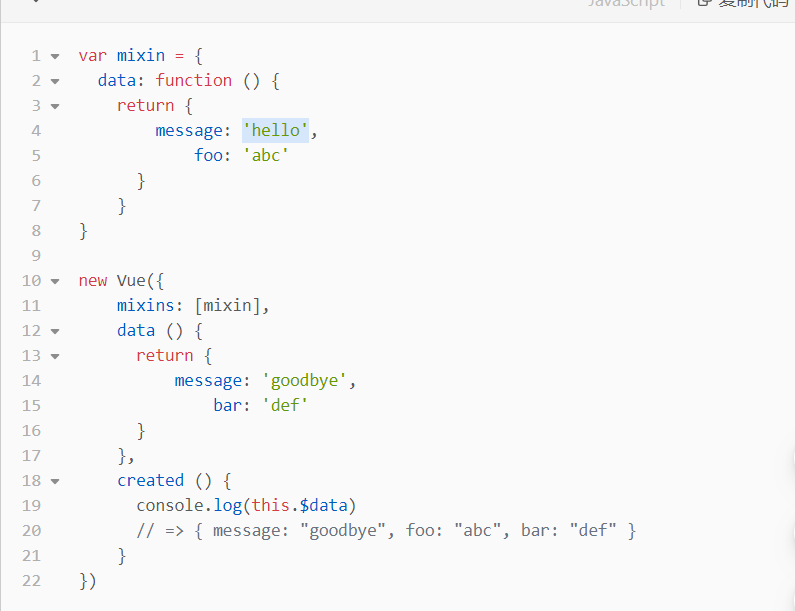

# vue上

1.  数据绑定
    1.  模板语法
        1.  1插值语法
            1.  功能：用于解析标签体的内容
            2.  写法：{{xxx}}，xxx是js表达式，可以直接读取到data中的所有区域
        2.  2指令语法
            1.  功能：用于解析标签（包括：标签属性，标签体内容，绑定事件）
            2.  举例：\<a v-bind:href="xxx"\>或简写为\<a :href="xxx"\>,xxx是js表达式，可以直接读取到data中的所有区域
    2.  数据绑定
        1.  单向绑定 v-bind数据只能从data流向页面
        2.  双向绑定v-model数据不仅能从data流向页面，还可以从页面流向data
    3.  备注
        1.  a.双向绑定-般都应用在表单类元素上,如 \| 等
        2.  b. v-model :value可以简写为v-model ，因为v-model 默认收集的就是value值
2.  el与data的两种写法
    1.  el有两种写法
        1.  a.创建Vue实例对象的时候配置el属性
        2.  b.先创建Vue实例，随后再通过vm. \$mount( '\#root')指定el的值
    2.  data有两种写法
        1.  a.对象式:data:{}
        2.  b.函数式: data() { return { } }
    3.  如何选择
        1.  目前哪种写法都可以，以后到组件时,data必须使用函数,否则会报错一个重要的原则由Vue管理的函数，一定不要写箭头函数， 否则this就不再是Vue 实例了
    4.  代码
        1.  

            

3.  mvvm模型 数据代理
    1.  mvvm模型
        1.  ●M:模型Model, data 中的数据
        2.  ●V:视图View,模板代码
        3.  ●VM:视图模型ViewModel，I Vue实例
        4.  观察发现.
            1.  data中所有的属性，最后都出现在了vm身上
            2.  vm身上所有的属性及Vue原型身上所有的属性，在Vue模板中都可以直接使用
    2.  vue中的数据代理
        1.  1\. Vue 中的数据代理通过vm对象来代理data对象中属性的操作(读/写 )
        2.  2\. Vue 中数据代理的好处:更加方便的操作data 中的数据
        3.  3.基本原理
            1.  a.通过object . defineProperty()把data对象中所有属性添加到vm - 上
            2.  b.为海个添加到vm.上的属性， 都指定一个\| getter，setter
            3.  c.在getter，setter内部去操作(读/写) data 中对应的属
            4.  

                

            5.  Vue将data中的数据拷贝了一份到\_ \_data 属性中，又将\_ \_data 里面的属性提到Vue实例中(如name)，通过defineProperty 实现数据代理，这样通过geter/setter 操作name,进而操作_data中的name。而data 又对data 进行数据劫持，实现响应式
4.  事件处理
    1.  事件的基本用法
        1.  1.使用v-on:xxx或@xx绑定事件,中xxx是事件名
        2.  2.事件的回调需要配置在methods 对象中，最终会在vm. 上
        3.  3\. methods 中配置的函数,不要用箭头函数,否则this就不是vm了
        4.  methods中配置的函数，都是被Vue 所管理的函数，this 的指向是vm或组件实例对象
        5.  5\. @click="demo" 和@click="demo(\$event)"效果一致, 后者可以传参
    2.  事件的修饰符
        1.  1\. prevent 阻止默认事件(常用)
        2.  2\. stop 阻止事件冒泡(常用)
        3.  3\. once事件只触发- -次(常用)
        4.  4\. capture 使用事件的捕获模式
        5.  5\. self 只贿event. target是当前操作的元素时才触发事件
        6.  6\. passive
        7.  事件的默认行为立即执行，无需等待事件回调执行完毕修饰符可以连续写，比如可以这么用: @click. prevent . stop=" showInfo'
        8.  

            

    3.  键盘事件
        1.  1.1 Vue 中常用的按键别名
            1.  回车enter
            2.  删除delete 捕获“删除”和“退格”键
            3.  退出esc
            4.  空格space !
            5.  换行tab特殊,必须配合keydown 使用
            6.  上up
            7.  下down
            8.  左\| left
            9.  右right
        2.  2 Vue 未提供别名的按键，可以使用按键原始的key值去绑定，但注意要转为kebab-case(多单词小写短横线写法)
        3.  3.系统修饰键(用法特殊) ctrl，alt， shift，meta( meta 就是win键)
            1.  a.配合keyup使用:按下修饰键的同时,再按下其他键,随后释放其他键，事件才被触发
            2.  指定ctr+y使用@keyup.ctr.y
            3.  b.配合keydown 使用:正常触发事件
        4.  4.也可以使用keyCode 去指定具体的按键(不推荐)
        5.  5\. Vue.config.keyCodes.自定义键名=键码，可以去定制按键别名
        6.  

            

5.  计算属性 侦听属性
    1.  1差值语法实现
        1.  

            

    2.  method实现
        1.  

            

    3.  computed计算属性
        1.  1.定义:要用的属性不存在，需要通过已有属性计算得来
        2.  2.原理:底层借助了objcet. defineproperty()方法提供的getter 和setter
        3.  3\. get 函数什么时候执行?
            1.  a.初次读取时会执行-次
            2.  b.当依赖的数据发生改变时会被再次调用
        4.  4.优势:与methods实现相比,内部有缓存机制(复用)， 效率更高，调试方便
        5.  5.备注
            1.  a.计算属性最终会出现在vm\_ 上，直接读取使用即可
            2.  b.如果计算属性要被修改,那必须写set 函数去响应修改，且set中要引\|起计算时依赖的
            3.  数据发生改变
            4.  C.
            5.  如果计算属性确定不考虑修改,可以使用计算属性的简写形式
        6.  代码
            1.  

                

    4.  watch监视属性
        1.  1.当被监视的属性变化时，回调函数自动调用,进行相关操作
        2.  2.监视的属性必须存在,才能进行监视，既可以监视data，也可以监视计算属性
        3.  3.配置项属性immediate:false，改为true,则初始化时调用一-次\| handler( newValue,oldValue )
        4.  4.监视有两种写法
            1.  a.创建Vue时传入watch: {}配置
            2.  b.通过vm. \$watch()监视
        5.  代码
            1.  

                

6.  绑定样式 条件渲染
    1.  绑定样式
        1.  class样式
            1.  写法: :class="xxx"，xxx可以是字符串、数组、对象
            2.  :style="[a,b]"中a、b是样式对象
            3.  :style="{fontSize: xxx}"中xXX是动态值
                1.  字符串写法适用于:类名不确定，要动态获取
                2.  数组写法适用于:要绑定多个样式，个数不确定,名字也不确定
                3.  对象写法适用于:要绑定多个样式，个数确定，名字也确定，但不确定用不用
            4.  

                

            5.  

                

    2.  条件渲染
        1.  v-if
            1.  ●写法跟if else语法类似
                1.  v- if="表达式"
                2.  v-else-if="表达式"
                3.  v-else
            2.  ●适用于:切换频率较低的场景，因为不展示的DOM元愫直接被移除
            3.  ●注意: v-if可以和v-else-if v-else 一起使用，但要求结构不能被打断
        2.  v-show
            1.  ●与法:v-show="表达式
            2.  适用于:切换频率较高的场景
            3.  ●特点:不展示的DOM元愫未被移除，仅仅是使用样式隐藏掉display: none
            4.  备注:使用v-if的时，元愫可能无法获取到，而使用v-show可以获取到template 标签不影响结构，页面html 中不会有此标签，但只能配合v-if，不能配合v-show
            5.  

                

7.  列表渲染 数据监视
    1.  基本列表
        1.  v-for指令
            1.  ●用于展示列表数据
            2.  ●语法:这里key可以是index，更好的是遍历对象的唯一标识
            3.  ●可遍历:数组、对象、字符串(用的少)、指定次数(用的少)
        2.  key的工作原理

            

            1.  

                

            2.  

                

8.  收集表单数据 过滤器
    1.  收集表单数据
        1.  

            

        2.  v-model的三个修饰符
            1.  a.lazy 失去焦点后收集数据
            2.  b.number输入字符串
            3.  c.trim 输入首尾空格过滤
        3.  

            

    2.  过滤器
        1.  注册过滤器：vue.filter（name，callback）全局过滤器 new vue{filters:{}} 局部过过滤器
        2.  使用过滤器：{{xxx\|过滤器名}} 或 v-bind：属性=“xxx\|过滤器名“
        3.  备注
            1.  a. 过滤器可以接收额外参数，多个过滤器也可以串联
            2.  b.并没有改变原本的数据，而是产生新的对应的数据
        4.  

            

9.  内置指令 自定义指令
    1.  内置指令
        1.  v-bind向绑定解析表达式，可简写为: !
        2.  v-model双向数据绑定
        3.  v-for遍历数组/对象/字符串
        4.  v-on绑定事件监听，可简写为@
        5.  v-show条件渲染(动态控制节点是否展示)
        6.  v-if条件渲染(动态控制节点是否存存在)
        7.  v-else-if条件渲染(动态控制节点是否存存在)
        8.  v-else条件渲染(动态控制节点是否存存在)
    2.  x-text
        1.  作用:所在的节点中渲染文本内容
        2.  与插值语法的区别: v-text 会替换掉节点中的内容，「{{xxx}} 则不会,更灵活
10. vue生命周期
    1.  生命周期
        1.  a.名生命周期回调函数、生命周期函数、生命周期钩子
        2.  b.是什么: Vue 在关键时刻帮我们调用的一些特殊名称的函数
        3.  c.生命周期函数的名字不可更改,但函数的具体内容是程序员根据需求编写的
        4.  d.生命周期函数中的this指向是vm或组件实例对象
    2.  

        

    3.  常用的生命周期钩子
        1.  a.mounted发送ajax请求、启动定时器、绑定自定义事件、订阅消息等初始化操作
        2.  b. beforeDestroy 清除定时器、解绑自定义事件、取消订阅消息等收尾工
    4.  关于销毁Vue实例
        1.  a.销毁后借助Vue开发者工具看不到任何信息
        2.  b.销毁后自定义事件会失效，但原胜DOM事件依然有效
        3.  c. -般不会在beforeDestroy 操作数据,因为即便操作数据，也不会再触发更新流程了
11. 组件化编程
    1.  组件化：当应用中的功能都是多组件的方式来编写的，那这个应用就是一个组件化的应用
    2.  2.非单文件组件
        1.  非单文件组件：一个文件中包含n个组件
        2.  单文件组件：一个文件只包含1个组件
    3.  

        

12. 初始化脚手架
    1.  步骤
        1.  1.如果下载缓慢请配置npm淘宝镜像npm config set registry http://registry . npm.
        2.  taobao .org
        3.  2.全安装@vue/cli npm install -g @vue/cli
        4.  3.切换到创建项目的目录，使用命令创建项目vue create xxx
        5.  4.选择使用vue的版本
        6.  5.启动项目npm run serve
        7.  6.抱项目npm run build
        8.  7.暂停项目Ctrl+C
        9.  Vue脚手架隐藏了所有webpack 相关的配置,若想查看具体的webpack配置，请执行
        10. vue inspect \> output.js
    2.  结构
        1.  .文件目录
        2.  ├── node_modules
        3.  ├── public
        4.  │ ├── favicon.ico: 页签图标
        5.  │ └── index.html: 主页面
        6.  ├── src
        7.  │ ├── assets: 存放静态资源
        8.  │ │ └── logo.png
        9.  │ │── component: 存放组件
        10. │ │ └── HelloWorld.vue
        11. │ │── App.vue: 汇总所有组件
        12. │ └── main.js: 入口文件
        13. ├── .gitignore: git版本管制忽略的配置
        14. ├── babel.config.js: babel的配置文件
        15. ├── package.json: 应用包配置文件
        16. ├── README.md: 应用描述文件
        17. └── package-lock.json: 包版本控制文件
13. ref props mixin plugin scoped
    1.  ref属性
        1.  ref 被用来给元素或子组件注册引用信息
            1.  应用在htm1标签上获取的是真实DOM元素，应用在组件标签上获取的是组件实例对象vc
            2.  使用方式
                1.  打标识: \<h1 ref="xxx"\>\</h1\> 或\<School ref="xxx"\>\</School\>
                2.  获取：this.\$refs. xXx
        2.  代码
            1.  

                

    2.  props配置项
        1.  props让组件接收外部传过来的数据
            1.  传递数据\<Demo name="xxx" :age="18"/\>这里age前加:，通过v-bind使得里面的18是数字
            2.  接受数据
                1.  第一种方式(只接收)props:[ 'name', ' age']
                2.  第二种方式(限制类型) props:{name :String, age :Number}
                3.  第三种方式(限制类型、限制必要性、指定默认值)
        2.  代码
            1.  

                

            2.  

                

            3.  

                

        3.  备注
            1.  props是只读的，Vue 底层会监测你对props 的修改,如果进行了修改,就会发出警告，若业务需求确实需要修改,那么请复制props 的内容到data 中，然后去修改data中的数据
    3.  mixin混入
        1.  功能：可以把多个组件共用的配置提取成一个混入对象
        2.  使用方式
            1.  1.定义混入
                1.  

                    

            2.  使用混入
                1.  1，全局混入 Vue.mixin(xxx)
                2.  2，局部混入mixins:['xxx']
        3.  备注
            1.  1.组件和混入对象含有同名选项时,这些选项将以恰当的方式进行“ 合并”,在发生冲突时以组件优先
                1.  

                    

            2.  2.同名生命周期钩子将合并为一个数组，因此都将被调用。另外,混入对象的钩子将在组件自身钩子之前调用
                1.  

                    

    4.  plugin插件
        1.  1.功能:用于增强Vue
        2.  2.本质:包含install方法的一个对象，install 的第一个参数是Vue，第二个以后的参数是插件使用者传递的数据
        3.  3.定义插件(见下src/plugin.js)
        4.  4.使用插件:Vue.use( )
        5.  代码
            1.  

                

            2.  

                

            3.  

                

            4.  

                

    5.  scoped
        1.  作用：让样式在局部生效，防止冲突
        2.  写法：\<style scoped\>
        3.  代码
            1.  

                

            2.  

                

            3.  

                

            4.  

                

14. 本地存储 和自定义事件
    1.  webstorage（js本地存储）
        1.  存储内容大小一般支持5MB左右(不同浏览器可能还不一样)
        2.  浏览器端通过Window. sessionStorage和Window . localStorage属性来实现本地存储机制
        3.  相关API
        4.  xxxStorage.setItem( 'key', 'value') 该方法接受-个键和值作为参数，会把键值对添加到存储中，如果键名存在，则更新其对应的值
        5.  xxxStorage. getItem( 'key' )该访法接受一个键名作为参数, 返回键名对应的值
        6.  xxxStorage. removeItem( 'key')该访法接受一个键名作为参数,并把该键名从存储中删除
        7.  xxxStorage.clear()该访法会清空存储中的所有数据
    2.  备注
        1.  Sess ionStorage存储的内容会随着浏览器窗口关闭而消失
        2.  LocalStorage存储的内容，需要手动清除才会消失
        3.  xxxStorage. getItem( xxx) 如果xxx对应的value获取不到，那么getItem() 的返回值是null
        4.  JSON. parse(null)的结果依然是null
    3.  代码
        1.  

            

        2.  

            

        3.  

            

    4.  组件的自定义事件
        1.  1\. -种组件间通信的方式，适用于:子组件===\>父组件
        2.  2.使用场景:子组件想给父组件传数据，那么就要在父组件中给子组件绑定自定义事件(事件的回调在A中)
        3.  3.绑定自定义事件
            1.  a.第一种方式，在父组件中或\<Demo @事件名=“ 方法”/\> 或\<Demo v-on=“ 方法”/\>
            2.  b.第二种方式,在父组件中this.\$refs .demo. \$on('事件名'，方法)
            3.  

                

        4.  4.触发自定义事件 this.\$emit('事件名',数据）
        5.  5解绑自义事件this.\$off(’事件名‘）
        6.  6组件上也可以绑定原生DoM事件，需要使用native修饰符，@click .native=''show''上面绑定自定义事件，即使绑定的是原生事件也会被认为是自定义的，需要加native，加了后就将此事件给组件的根元素
